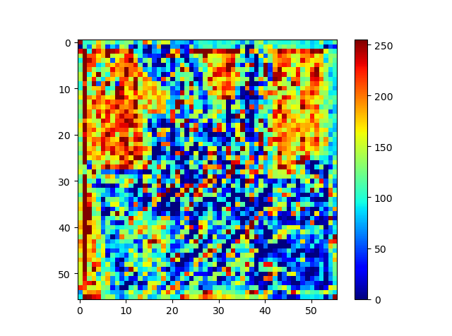
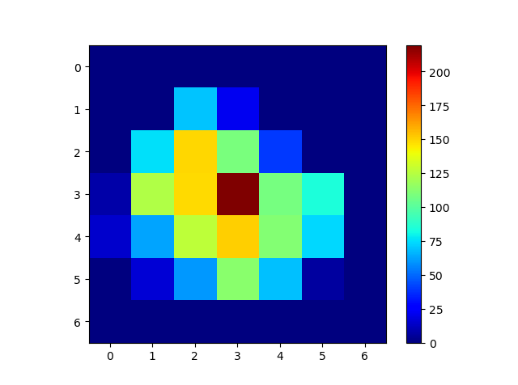

# visualization-of-feature-map
在这里，我可视化深度神经网络的中间结果，来研究卷积层对input的激活。下面两张图像分别是浅层（resnet的layer1）和深层(resnet的layer4)卷积的feature map的可视化结果。从以下两张图可知，浅层神经网络对于input具有更多的响应，而深层神经网络对input具有更少的响应。这也从一方面映射了浅层神经网络学习了一些普遍的特征如颜色，纹理等等；而深层神经网络则学习到了一些具有判别性的特征。对于以上这个结论，我们还可以通过可视化神经网络所学习到的特征来证明。在这里，我采用了最大激活值来生成feature image，但由于所生成的image缺少一定的可解释性和visual，所以我便不再对齐进行展示。接下来，我将研究如何来生成一张更具备解释性和可视化的image。  

